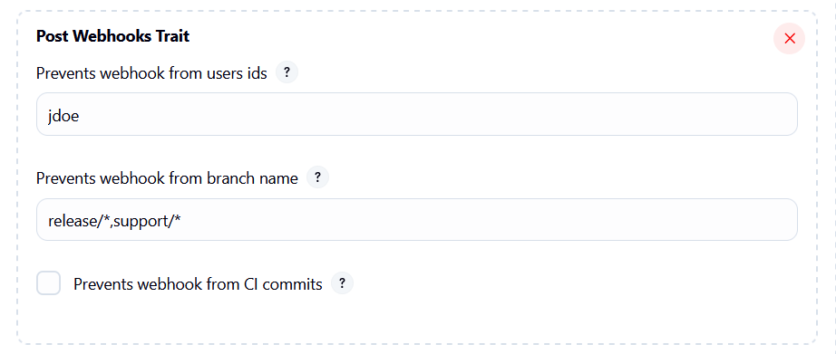
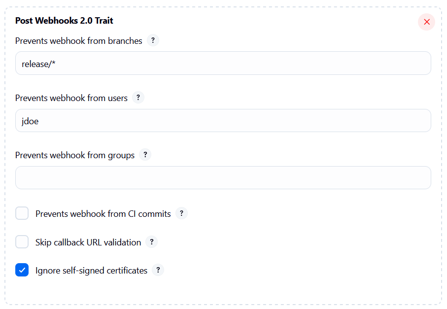

= Bitbucket Webhooks Plugin

image:https://ci.jenkins.io/job/Plugins/job/bitbucket-webhooks-plugin/job/master/badge/icon/[Build Status,link=https://ci.jenkins.io/job/Plugins/job/bitbucket-webhooks-plugin/job/master]
image:https://img.shields.io/jenkins/plugin/i/bitbucket-webhooks-plugin?color=blue[Installations, link=https://plugins.jenkins.io/bitbucket-webhooks/]
image:https://img.shields.io/github/contributors/jenkinsci/bitbucket-webhooks-plugin.svg?color=blue[Contributors,link=https://github.com/jenkinsci/bitbucket-webhooks-plugin/contributors]
image:https://img.shields.io/github/release/jenkinsci/bitbucket-webhooks-plugin.svg?label=release[GitHub release,link=https://github.com/jenkinsci/bitbucket-webhooks-plugin/releases/latest]

== Introduction

The Bitbucket Webhooks plugin allows you to integrate a webhook plugin available at Atlassian by third parties vendor. Usually they provides extra functionalities than native implementation shipped with the Bitbucket Source Branch plugin.
This plugin is caused by https://issues.jenkins.io/browse/JENKINS-74913[JENKINS-74913] and https://issues.jenkins.io/browse/JENKINS-76108[JENKINS-76108]

== How to use this plugin

After installing, go to Manage Jenkins -> System configuration page. Under "Bitbucket Server" section you can choose your webhook implementation.

image::docs/images/screenshot-1.png[]

== Development of this plugin

See the https://www.jenkins.io/doc/developer/tutorial[Jenkins Plugin Tutorial] for information on development environment setup and testing of plugins.

== Supported plugin

Supported plugins available from Atlassian marketplace:

* <<#jenkins-and-azure-devops-post-webhooks-for-bitbucket,Jenkins and Azure DevOps Post Webhooks for Bitbucket>>
* <<#webhook-to-jenkins-for-bitbucket,Webhook to Jenkins for Bitbucket by Appfire>>

=== Jenkins and Azure DevOps Post Webhooks for Bitbucket

This plugin is developed by the company https://www.moveworkforward.com/product/post-webhooks-for-bitbucket[moveforward] and provides additional functionality to prevent webhooks from being forwarded if certain configurable conditions are met.
It has been available on the marketplace since the beginning, before the native implementation for Bitbucket Server was available.
There are two versions of the REST API endpoint; this plugin implements both, but version 2 is in beta.
When configuring a new Bitbucket Server endpoint in the _Manage Jenkins_ -> _System_ menu, you must select which webhook implementations to use:

image::docs/images/screenshot-1.png[]

When setting up a Jenkins _Multibranch_ or _Organization_ project, there is a specific feature available to configure extra functionality:

Configuration available in version 1.0:

Configuration available in version 2.0:

=== Webhook to Jenkins for Bitbucket

This plugin is developed by the company https://appfire.atlassian.net/wiki/spaces/JENK/overview[appfire].

_Help wanted to integrate all the functionalities of this bitbucket plugin._
