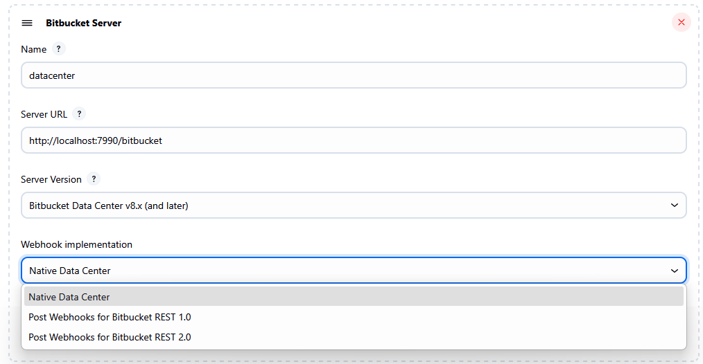

= Bitbucket Webhooks Plugin

image:https://ci.jenkins.io/job/Plugins/job/bitbucket-webhooks-plugin/job/master/badge/icon[Build Status,link=https://ci.jenkins.io/job/Plugins/job/bitbucket-webhooks-plugin/job/master]
image:https://img.shields.io/jenkins/plugin/i/bitbucket-webhooks-plugin?color=blue&label=installations[Installations,link=https://stats.jenkins.io/pluginversions/badge.html]
image:https://img.shields.io/github/contributors/jenkinsci/bitbucket-webhooks-plugin.svg?color=blue[Contributors,link=https://github.com/jenkinsci/bitbucket-webhooks-plugin/contributors]
image:https://img.shields.io/github/release/jenkinsci/bitbucket-webhooks-plugin.svg?label=release[GitHub release,link=https://github.com/jenkinsci/bitbucket-webhooks-plugin/releases/latest]

== Introduction

The Bitbucket Webhooks plugin allows you to integrate a webhook plugin available at Atlassian by third parties vendor. Usually they provides extra functionalities than native implementation shipped with the Bitbucket Source Branch plugin.
This plugin is caused by https://issues.jenkins.io/browse/JENKINS-74913[JENKINS-74913] and https://issues.jenkins.io/browse/JENKINS-76108[JENKINS-76108]

== How to use this plugin

After installing, go to Manage Jenkins -> System configuration page. Under "Bitbucket Server" section you can choose your webhook implementation.

== Development of this plugin

See the https://www.jenkins.io/doc/developer/tutorial[Jenkins Plugin Tutorial] for information on development environment setup and testing of plugins.
